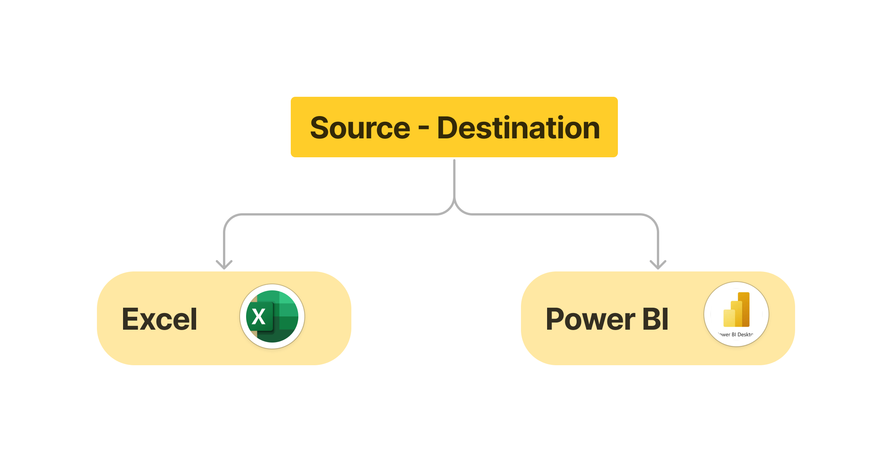

# VanArsdel and its competitors
## market share analysis for year 2017
## Excel to Power BI Project




# Table of contents 

- [Objective](#objective)
- [Data Source](#data-source)
- [Stages](#stages)
- [Design](#design)
  - [Mockup](#mockup)
  - [Tools](#tools)
- [Development](#development)
  - [Pseudocode](#pseudocode)
  - [Data Exploration](#data-exploration)
  - [Data Cleaning](#data-cleaning)
  - [Transform the Data](#transform-the-data)
  - [Create the SQL View](#create-the-sql-view)
- [Testing](#testing)
  - [Data Quality Tests](#data-quality-tests)
- [Visualization](#visualization)
  - [Results](#results)
  - [DAX Measures](#dax-measures)
- [Analysis](#analysis)
  - [Findings](#findings)
  - [Validation](#validation)
  - [Discovery](#discovery)
- [Recommendations](#recommendations)
  - [Potential ROI](#potential-roi)
  - [Potential Courses of Actions](#potential-courses-of-actions)
- [Conclusion](#conclusion)


# Objective 

- What is the key pain point?
  
- Chief Marketing Officer (CMO) wants to know how well does VanArsdel product sell within the industry the for year 2017.
- Also, how well is VanArsdel doing against their competing product in the industry for the year 2017.


- What is the ideal solution? 

To create a dashboard that provides insights into the VanArsdel and its competitors market share analysis for year 2017 that includes their 
- Revenue and Unit by Month
- Revenue by Manufacturer
- Sum of Revenue by Segment
- Sum of Revenue by MonthName and Manufacturer(groups)
- Sum of Revenue by State and Segment
- Sales by State

This will help the Chief Marketing Officer (CMO) make informed decisions about how well does VanArsdel product sell and how well is VanArsdel doing against their competing product in the industry for the year 2017.

## User story 

As the the Chief Marketing Officer (CMO) of VanArsdel Company, I want to use a dashboard that analyses how well our company product sell in 2017. 
This dashboard should allow me to identify how well is our product doing against our competing product in the industry for the year 2017.
This dashboard should allow me to analyse sales revenue accross all manufaturers on the year 2017. 
This dashboard should allow me to analyse revenue by manufaturers on the year 2017.
This dashboard should allow me to analyse sales by segment on the year 2017. (Segment report).
This dashboard should allow me to compare VanArsdel sales and revenue with other competitors.
This dashboard should allow me to identify or show the market shares analysis.
This dashboard should allow me to analyse Sales by State
This dashboard should allow me to compare revenue by category and state in tabular view.

With this information, I can make more informed decisions abouthow well our company VanArsdel product sell in 2017.
Also how well VanArsdel product doing against our competing product in the industry for the year 2017. 


# Data source 

- What data is needed to achieve our objective?

We need data on the VanArsdel Company in 2017 that includes their 
- sales
- product
- geograpy
- date

   Where is the data coming from? 
Sales data along with details of Product, Date and Geography are available in an Excel workbook. Data from these sources need to be brought together to analyze and report on.

# Stages (ETL)
- Import Data
- Clean Data
- Manage relationship
- Design
- Developement
- Testing
- Analysis 

##  Import Data
- Get Data

## Transform Data
- Clean Data

## Manage relationship
- We need to load data from 4 tables
- We need to ensure the model identifies relationship between these tables.
  
# Design 

## Dashboard components required 
- What should the dashboard contain based on the requirements provided?

 To understand what it should contain, we need to figure out what questions we need the dashboard to answer:
1. Any sales that happened, we want to analyse it by month for year 2017 for each manufactural 
2. Who is contributiing more total sales?
3. Which seginment is making the highest sales?
4. Which company is making the highset market shares?
5. To compare VanArsdel with the rest of the competitors

For now, these are some of the questions we need to answer, this may change as we progress down our analysis. 


## Dashboard mockup

- What should it look like? 

Some of the data visuals that may be appropriate in answering our questions include:

1. Line and Clustered Column chart
2. Treemap chart
3. Donut chart
4. Stacked area chart
5. Map visual 
6. Matrix visual 


## Tools 


| Tool | Purpose |
| --- | --- |
| Excel | Exploring the data |
| Power BI | Cleaning, testing, and analyzing the data |
| Power BI | Visualizing the data via interactive dashboards |
| GitHub | Hosting the project documentation and version control |
| Mokkup AI | Designing the wireframe/mockup of the dashboard | 


# Development

## Pseudocode

- What's the general approach in creating this solution from start to finish?

1. Get the data
2. Explore the data in Excel
3.Transform the data in Power BI
5. Clean the data with Power BI
6. Load the data into Power BI
7. Test the data with Power BI
8. Visualize the data in Power BI
9. Generate the findings based on the insights
10. Write the documentation + commentary
11. Publish the data to GitHub Pages

## Data exploration notes

This is the stage where you have a scan of what's in the data, errors, inconcsistencies, repitetions, weird and corrupted characters etc  


- What are your initial observations with this dataset? What's caught your attention so far?

1. There are at least 4 tables that contain the data from these sourcesthat is  need for to be brought together to analyse and report on, which signals we have everything we need from the file without needing to contact the VanArsdel company and competitors for any more data. 
2. The Date table contains the Month column, this is a repetition we do not need Month column -  we need to remove  Month column from the Date column.
3. The product table contains the Product Name and Product ID is concatenated in Product column, we need to split it so that we have just the Product Name. -  we need to use Split Column by Delimiter, Enter “-“ in the text area. Product column is split into two columns Product.1 and Product.2. We do not need Product.2 since we already have a ProductID column. Remove Product.2 and Rename Product.1 to Product.
4. We have now transformed all the data in the query editor, then we close and apply to load all the tables into Power BI 


- What do we expect the clean data to look like? (What should it contain? What contraints should we apply to it?)

The aim is to refine our dataset to ensure it is structured and ready for analysis. 

The cleaned data should meet the following criteria and constraints:

- Only relevant columns should be retained.
- All data types should be appropriate for the contents of each column.
- No column should contain null values, indicating complete data for all records.


Below is a table outlining the constraints on our cleaned dataset:

| Description | Date |
| --- | --- |
| Number of Rows | 731 |
| Number of Columns | 5 |

| Description | Product |
| --- | --- |
| Number of Rows | 1,245 |
| Number of Columns | 7 |

| Description | Geo |
| --- | --- |
| Number of Rows | 7,416 |
| Number of Columns | 6 |

| Description | Sales |
| --- | --- |
| Number of Rows | 117,917 |
| Number of Columns | 5 |


- What steps are needed to clean and shape the data into the desired format?

1. Remove unnecessary columns by only selecting the ones you need
2. Extract Youtube channel names from the first column
3. Rename columns using aliases
   
   
## Manage relationship

## grouping VanArsdel and its competitors

# Visualization 


## Results

- What does the dashboard look like?


This shows the VanArsdel and its competitors market share analysis for year 2017 so far. 

## DAX Measures

### 1. Total Revenue 
```
    Total Revenue = Sum(Sales[Revenue])

RETURN Total Revenue

```

### 2. Revenue less charge = Sales[Revenue]-1
```
    Revenue less charge = Sales[Revenue]-1

RETURN Revenue less charge

```

### 3.  Total Tax 
```
    Total Tax = SUM(Sales[Revenue]) *0.18

RETURN Revenue less charge

```

### 4.  Total Unit
```
   Total Unit = SUM(Sales[Units])

RETURN Revenue less charge

```

### 5.  Competitors Tax
```
  Competitors Tax = CALCULATE ([Total Tax],'Product'[Manufacturer (groups)] = "Competitors")

RETURN Competitors Tax

```

To see tax paid across califonia 

### 6.   CA Tax 
```
   CA Tax = CALCULATE([Total Tax], Geo[State] = "CA")

RETURN  CA Tax 

```
### 7.  % Comp Tax
```
   % Comp Tax = [Competitors Tax] / [Total Tax]

RETURN  % Comp Tax

```
### 8.   % VA Tax
```
  % VA Tax = 1 - [% Comp Tax]

RETURN  % VA Tax

```
### 9.  SPLY (Same peroiod last year)
```
SPLY = CALCULATE([Total Revenue],SAMEPERIODLASTYEAR('Date'[Date]))

RETURN SPLY

```
### 10.   % Growth
```
% Growth = [SPLY] / [Total Revenue]

RETURN % Growth

```

### Predictive

### Forecasting


### Comparing VanArsdel Sales and Revevene with other competitors.
The insight on the manufacturuing dashboard
As conclusion the the stack areas shows diffrenebt manufactures revenues in diffrent monthe and years but we only have a data for about six month 2017. Based on everything on the report in March they generated and extra highest revenues of 4,80900, April 4.6 and the lowest month of January and it increase gradually up to March.
Based on the revenue ValArsdel has the highest revenue compare to the other competitors. Also second of Natura,following by Alqui which was arround 3.06 million and pirum.
Also ValArsdel have the highest amount of market share compare ti the other markets in Califonia, New York, and Texas.

Also there was the maxify increase from Febuary to March which we donot understand why it happen do they spend more money on advert or more marketing just to understand why it happen.
Also in march accounted for 4.8 millon 

## Discovery

- What did we learn?

We discovered that 


1. NoCopyrightSOunds, Dan Rhodes and DanTDM are the channnels with the most subscribers in the UK
2. GRM Daily, Man City and Yogscast are the channels with the most videos uploaded
3. DanTDM, Dan RHodes and Mister Max are the channels with the most views
4. Entertainment channels are useful for broader reach, as the channels posting consistently on their platforms and generating the most engagement are focus on entertainment and music 


## Recommendations 

- What do you recommend based on the insights gathered? 
  
1. Dan Rhodes is the best YouTube channel to collaborate with if we want to maximize visbility because this channel has the most YouTube subscribers in the UK
2. Although GRM Daily, Man City and Yogcasts are regular publishers on YouTube, it may be worth considering whether collaborating with them with the current budget caps are worth the effort, as the potential return on investments is significantly lower compared to the other channels.
3. Mister Max is the best YouTuber to collaborate with if we're interested in maximizing reach, but collaborating with DanTDM and Dan Rhodes may be better long-term options considering the fact that they both have large subscriber bases and are averaging significantly high number of views.
4. The top 3 channels to form collaborations with are NoCopyrightSounds, DanTDM and Dan Rhodes based on this analysis, because they attract the most engagement on their channels consistently.


### Potential ROI 
- What ROI do we expect if we take this course of action?

1. Setting up a collaboration deal with Dan Rhodes would make the client a net profit of $1,065,000 per video
2. An influencer marketing contract with Mister Max can see the client generate a net profit of $1,276,000
3. If we go with a product placement campaign with DanTDM, this could  generate the client approximately $484,000 per video. If we advance with an influencer marketing campaign deal instead, this would make the client a one-off net profit of $404,000.
4. NoCopyrightSounds could profit the client $642,000 per video too (which is worth considering) 


### Action plan
- What course of action should we take and why?

Based on our analysis, we beieve the best channel to advance a long-term partnership deal with to promote the client's products is the Dan Rhodes channel. 

We'll have conversations with the marketing client to forecast what they also expect from this collaboration. Once we observe we're hitting the expected milestones, we'll advance with potential partnerships with DanTDM, Mister Max and NoCopyrightSounds channels in the future.   

- What steps do we take to implement the recommended decisions effectively?


1. Reach out to the teams behind each of these channels, starting with Dan Rhodes
2. Negotiate contracts within the budgets allocated to each marketing campaign
3. Kick off the campaigns and track each of their performances against the KPIs
4. Review how the campaigns have gone, gather insights and optimize based on feedback from converted customers and each channel's audiences 
